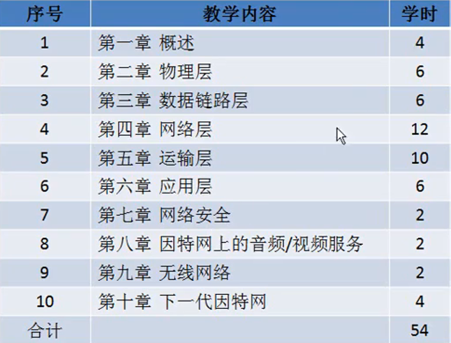
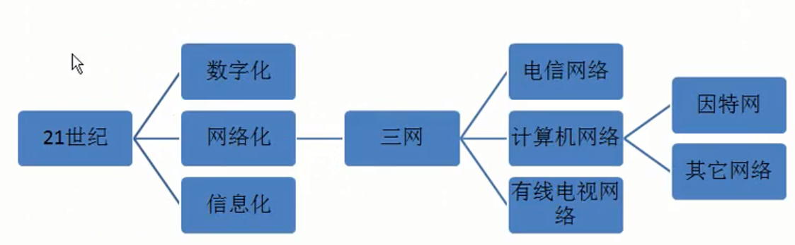

## 课程安排相关

## 计算机网络在信息时代的作用

* 什么是数字化？
    * 我们现实生活中的信息，都能够变成计算机能够处理的数据(01010101)
* 什么是网络化
    * 利用网络进行信息交互
* 什么是信息化
    * 比如手机打电话，qq聊天，各种信息的交互
 * 三网
    * 电信网络
    * 计算机网络
        * 因特网络
        * 其他网络
            * 例如某些专用私有网络(政府专用网咯)
    * 有线电视网络
        * 数字交互主要是单向的， 服务商向用户推送，以后会变成双向的，用户可以点播
* 如果没有网络？？？
* 计算机网络的重要功能
    * 连通性
        * 彼此联通，交互信息
    * 共享
        * 信息共享、软硬件共享
            * 软件共享
                * 例如：如果一台远程计算机上面的软件我可以远程进行使用
            * 硬件共享
                * 远程计算机连接了一个打印机，我能够远程进行使用

