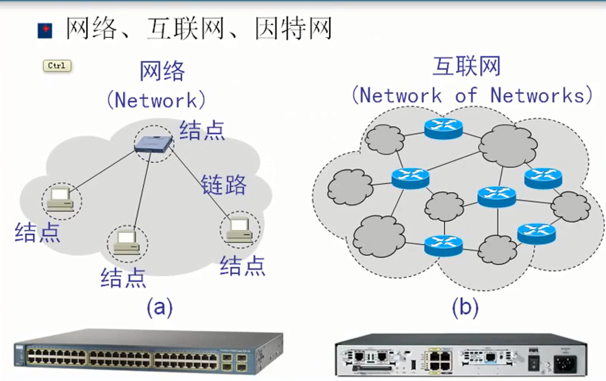
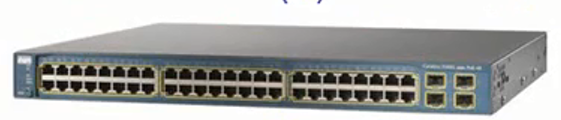
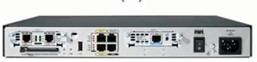
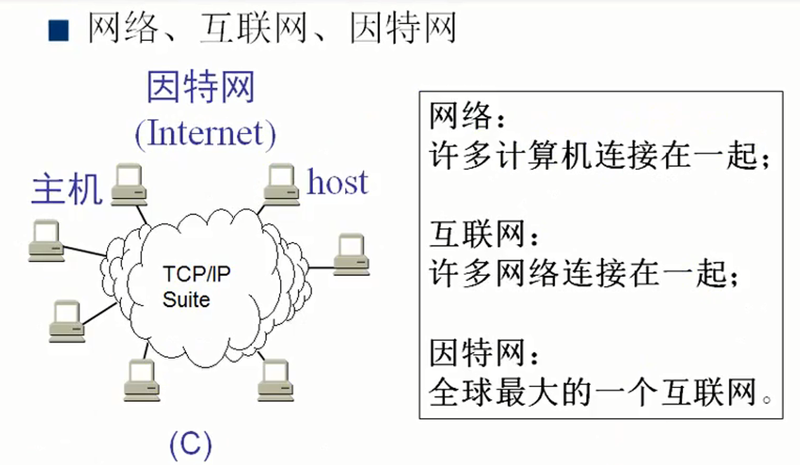
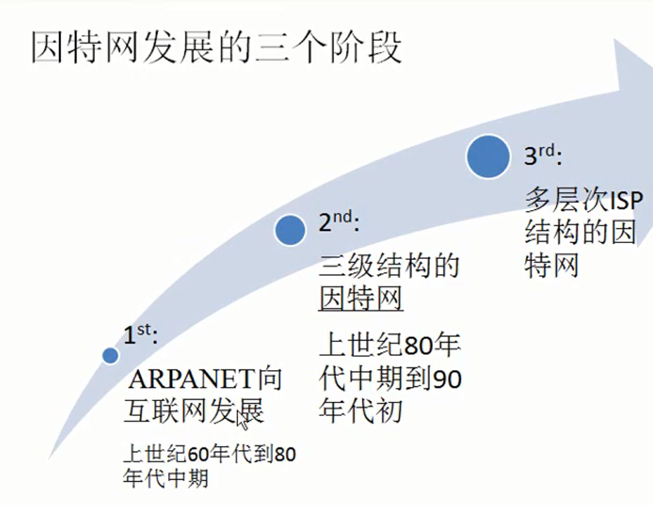
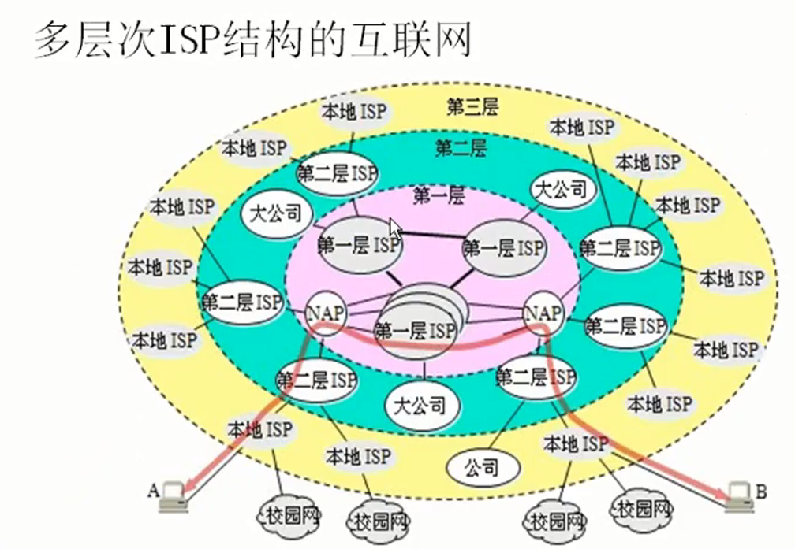
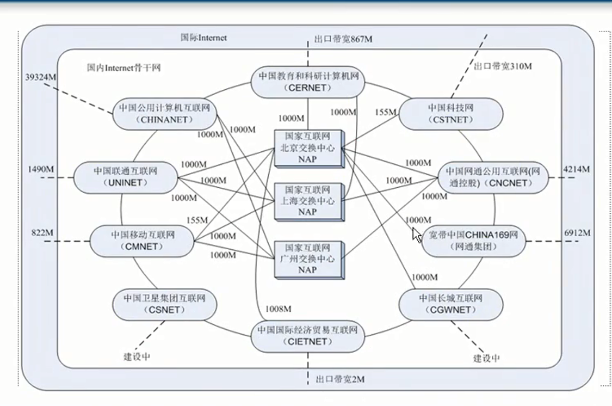
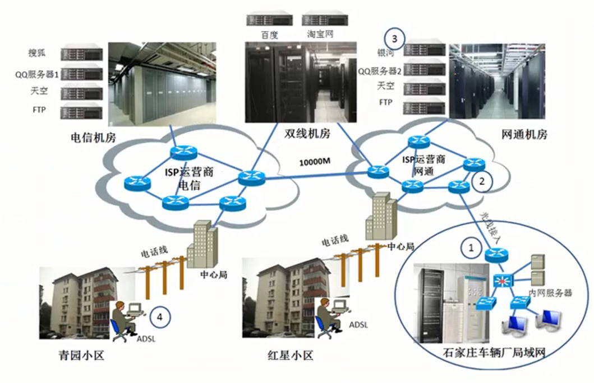
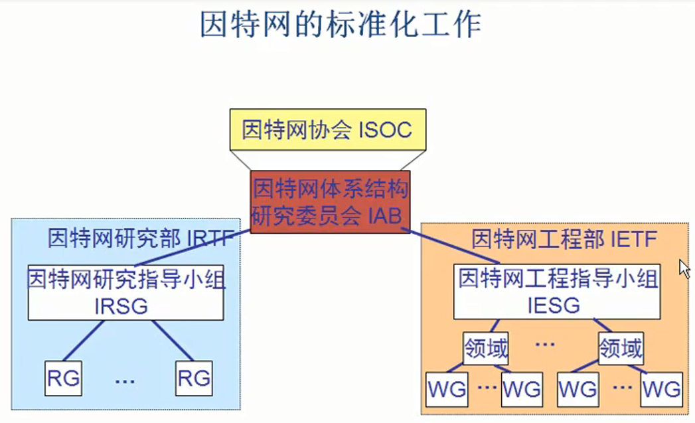
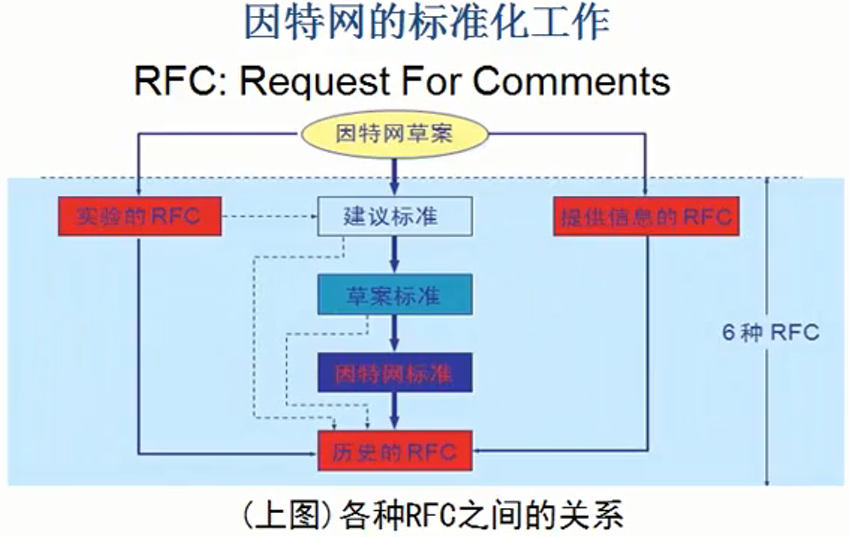

# 因特网概述
## 因特网概述


* 网络(Network)
    * 计算机通过集线器或者交换机组建的一个局域网，这就是一个网络
    * 网络设备称之为节点
    * 连接线路称之为链路(一般链路不超过100M)
* 互联网（Network of Networks）
    * 网络和网络之间连接起来就叫做互联网(通过路由器连接)
    * 并且路由器可以有广域网接口，可以传的很远，这样网络从距离上被拓展了
    * 通过路由器连接各个交换机，网络中的设备从数量上也被拓展了
* 交换机与路由器
    * 交换机
        * 图解
            
    * 路由器
        * 图解
            
        * 一般路由器没有很多的口，因为不需要，一个路由器如果有四个口就可以连接四个交换机，也就是连接四个网络
## 什么是因特网？

* 网络
    * 许多计算机连接在一起
* 互联网(internet)
    * 许多网络连接在一起
* 因特网(Internet)
    * 全球最大的一个互联网
    * 使用TCP/IP协议族

## 因特网发展阶段

* 第一个阶段(ARPANET向互联网发展，上世纪60年代到80年代)
    1. 1969年，美国研发的ARPANET
        * 分组交换网
    2. 1975年，出现了互联网
        * 分组交换网进行了
    3. 1983年，TCP/IP协议出现
        * 由美国国防部研制，没有想过对外开放
        * 没有有很多安全问题没有考虑，但是现在Internet是一个开放的网络
            * 例如arp欺骗
        * IPv6融入了各种安全问题
* 第二个阶段(三级结构的因特网)
    1. 开始于1985年，美国国家基金会围绕六个大型计算机中心建设计算机网络，共分为三级
        ```
            主干网络
                地区网
                    学校、家庭网络

        ```
        * 1993年，主干网带宽为45M

* 第三个阶段(多层次ISP结构的因特网)
    * 1993年，美国国家政府不再负责主干网络的运行，交给了各个ISP--Internet service privider
        * 一级别ISP、二级ISP。。。
        * 联通、电信，ip地址有统一的规划
    * 多层次isp结构的互联网
        
    * 中国互联网图解
        
    * ISP、企业网以及网民
        
    * 因特网的标准化工作
        
        


