# 因特网的组成
## 本节知识结构图
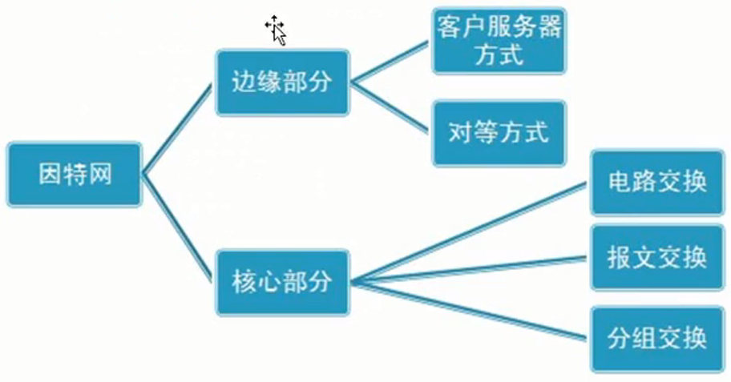
## 边缘部分和核心部分技术
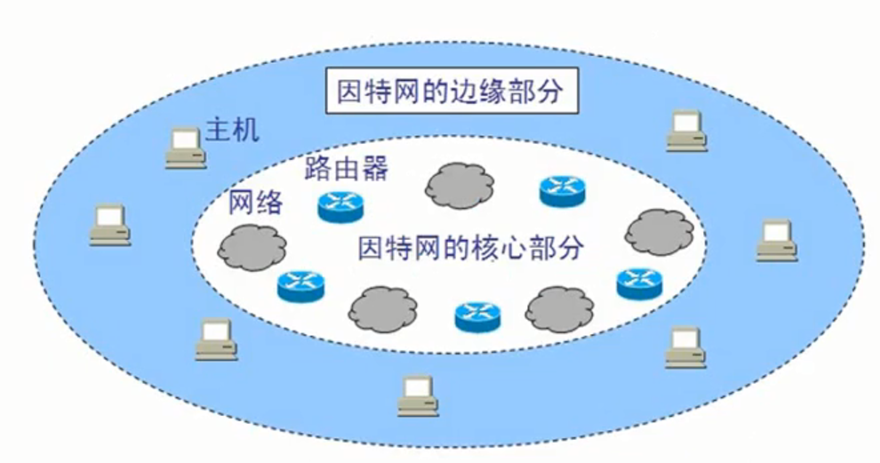
* 核心部分
    * 能够让计算机通信的这些网络
* 边缘部分
    * 计算机接入到网络都属于边缘部分
* 因特网边缘部分技术
    * 图解
        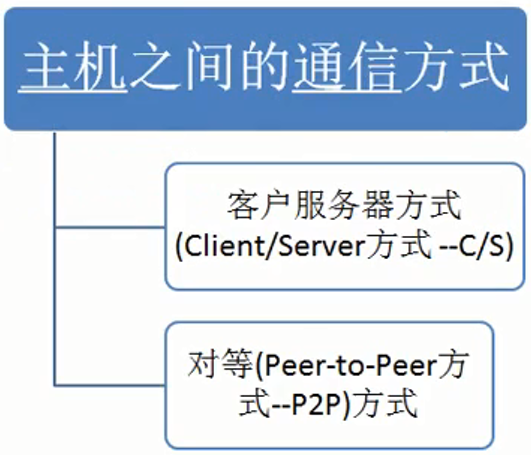
    * 客户服务器方式(Client/Server方式--C/S)
        * 图解
            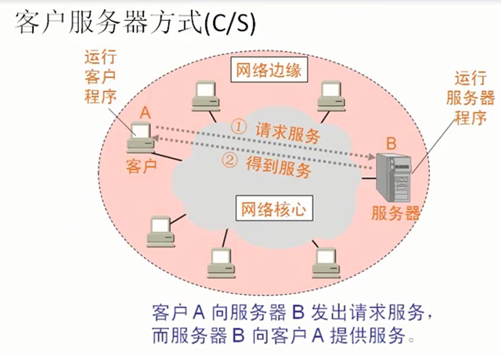
    * 对等(Peer-to-Peer方式--P2P)方式
        * 图解
            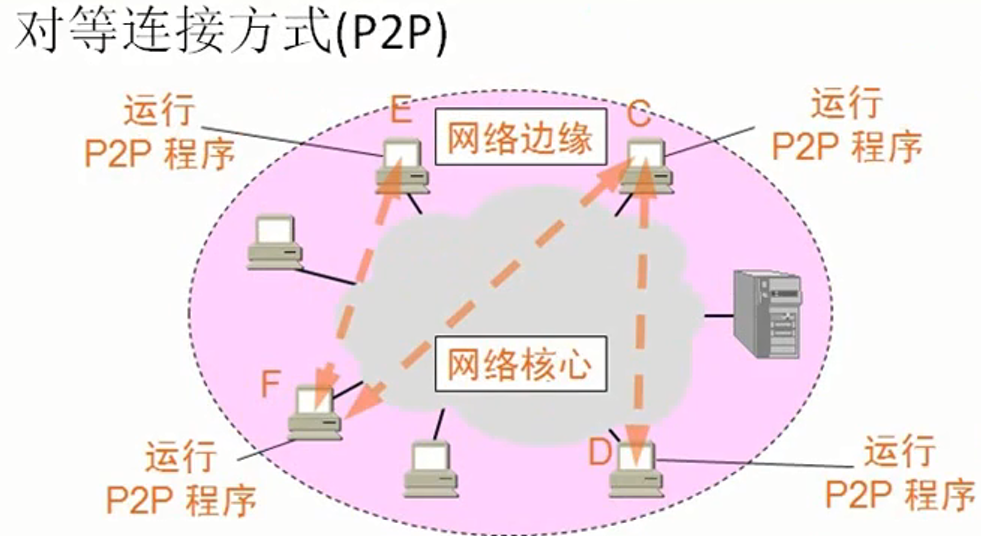
        * 下载原理
            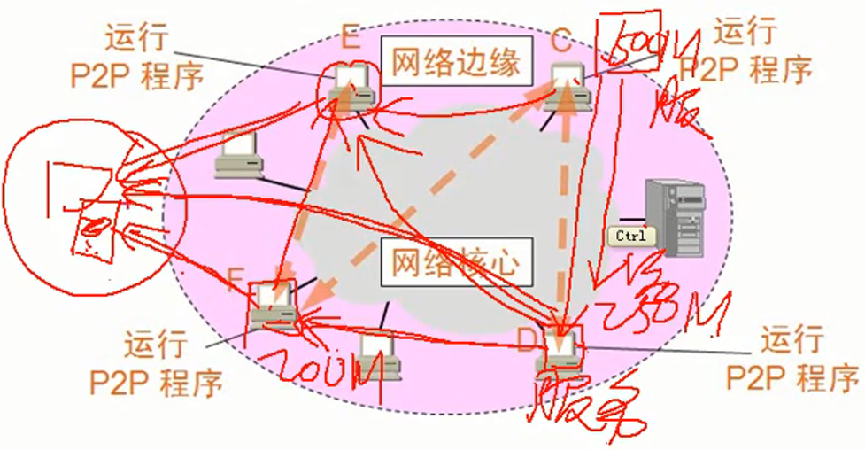
            * 能够同时有多个下载源，分别从多个源处进行下载，源越多，速度越快
* 因特网的核心部分技术
    * 图解
        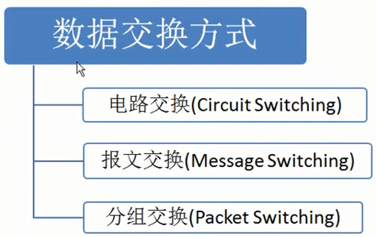
    * 计算机网络就是使用的分组交换的技术
    * 电路交换
        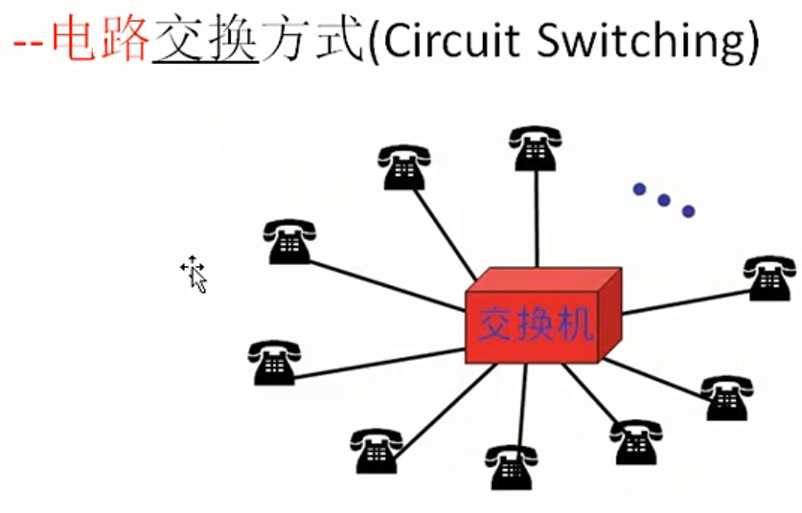
        * 典型应用就是电话，当两个设备进行通话时，交换机内部把两根线连接上，通话完毕断开连接
        * 电路交换面向连接
            * 建立连接---申请占用通信自愿
            * 通话------一直占用通信自愿
            * 释放连接---释放通信资源
        * 当通信时，临时建立专用通信线路
        * 电路交换适合于数据量很大的实时性传输(允许使用十分钟建立通信，之后稳定通信)：核心路由器之间可以使用电路交换。
    * 分组交换
        * 图解
            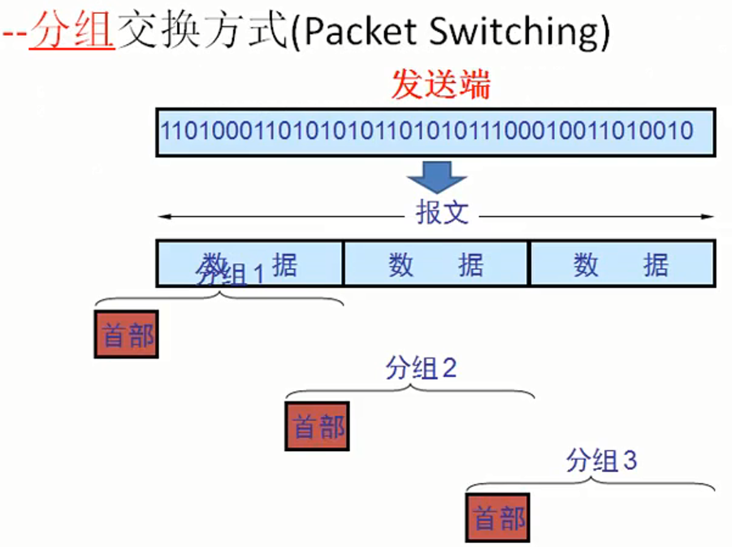
        * 假如原始需要发送数据有20M大小(又称之为报文)，首先会将数据分割为几个部分，每段加上首部(目的地址 原地址)，构成多个分组。然后分别发送
        * 在接收端去除各个分组的首部，将数据拼接，构成源数据
        * 分组的转发是由路由器控制的，两个相同的主机之间通信可能会形成不同的路径(路由器的转发路径不同导致)
        * 分组交换的特点
            * 不会占用线路，整个网络中的线路都可以复用，不需要建立连接。
        * 路由器具有存储转发的功能
            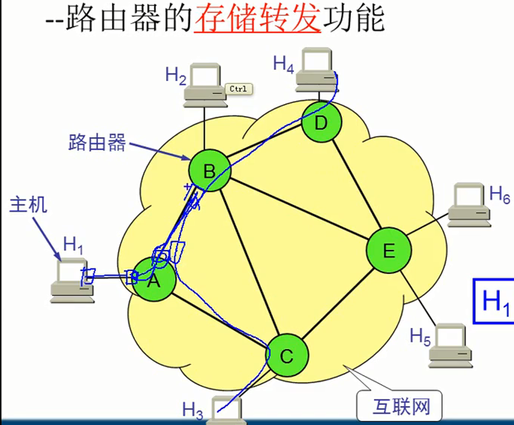
            * 如果路由器在转发一个分组的时候，又有另一个分组请求转发，那么会在路由器端口处进行排序，等待转发
            * 一个数据包进入路由器后，首先会在路由器暂存，查找转发表，找到转发的端口 
        * 分组交换优缺点
            * 优点
                * 高效
                * 灵活
                * 迅速
                * 可靠
            * 缺点
                * 时延
                * 开销
    * 报文交换(Message Switching)
        * 报文一般比分组长的多 (就是整个报文一下发送出去)
        * 报文交换的时延较长
* 三种交换方式的比较
    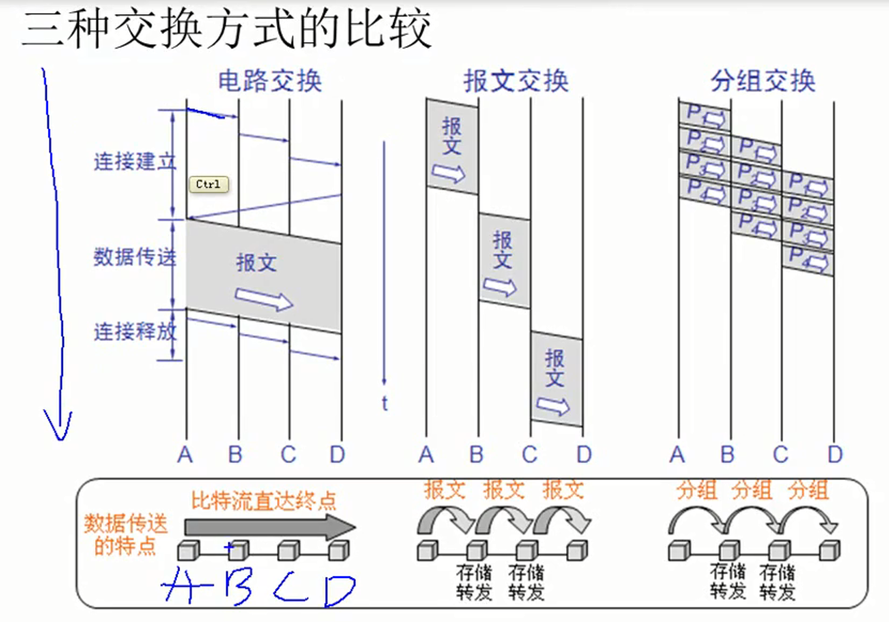

