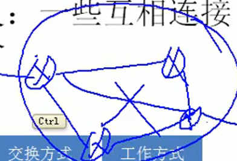

# 计算机在我国的发展
## 统计数据
* 中国在1994年4月20日正式介入互联网
* 到2012年6月份，网民5.38亿，手机网民接近6亿
## 计算机网络类别
* 计算机网络最简单的定义，一些互相连接的、自治的计算机的集合

1. 按照作用范围分类
    * 旧的分类(单纯按照作用范围)
        * 广域网(WAN)
        * 城域网(MAN)
        * 局域网(LAN)
        * 个人区域网(PAN)
    * 新的理解
        * 不单单从网络的覆盖范围区分局域网和广域网
        * 应用了广域网技术就叫做广域网
        * 应用了局域网技术就叫做局域网
        * 例如
            * 图解
                
            * 你和你的邻居之间进行数据通信，如果通过ADSL拨号上网进行数据传输，那么就是使用广域网技术进行通信(局域网不超过100m)
            * 如果直接使用无线、或网线连接通信，那么是局域网
        * 局域网、广域网概念
            * 局域网
                * 自己购买设备，自己维护，带宽固定。100M，1000M 距离100m以内
            * 广域网
                * 花钱买服务、花钱买带宽
2. 按照使用者来划分
    * 公用网络(public network)
    * 专用网络(private network)
3. 拓扑结构
    * 总线型
        
    * 环型
        
    * 星型
        
    * 树型
        
    * 网型
        
4. 交换防止
    * 电路交换
    * 分组交换
    * 报文交换
5. 工作方式
    * 资源子网
    * 通信子网
    * 接入网

