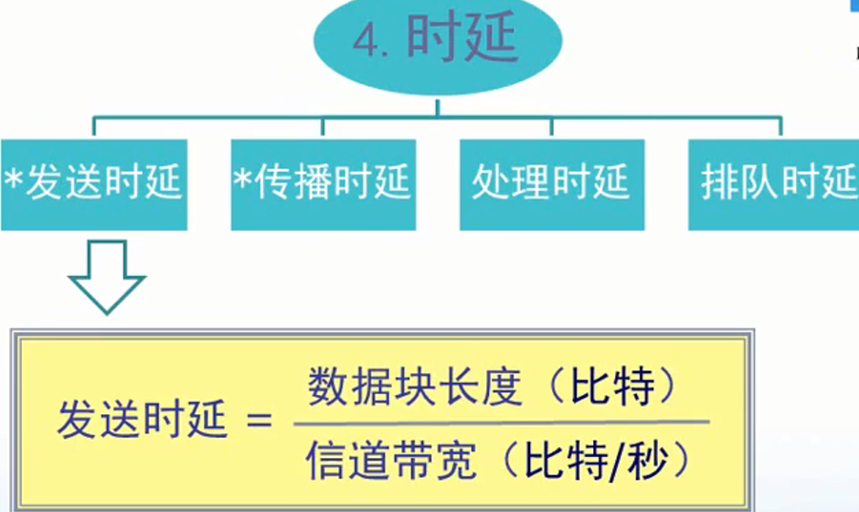

# 计算机网络的性能

## 详解
1. 速率
    * 连接在计算机网络上的主机在数字信道上传送数据位数的速率，也称为data rate或bit rate
    * 单位是b/s,kb/s,Mb/s,Gb/s.
    * 假如电脑在用2M带宽在看电影，再用4M带宽下载文件，那么这是两个信道，一个接收端，一个发送端，这叫做一个信道
2. 带宽
    * 数据通信领域中，数字信道所能传送的最高数据率
    * 单位是b/s,kb/s, Mb/s, Gb/s
3. 吞吐量
    * 即在单位时间内通过某个网络的数据量
    * 单位b/s,Mb/s等
    * 例如
        * 我一台计算机，以2M的速率在看电影，以4M的速率在下载文件。那么我计算机的吞吐量为6M
4. 时延
    * 图解
        
    * 发送时延
        * 数据包很长，整个数据包从计算机发送出去所需要的时间(和火车出站一样)
        * 发送时延 = 数据块长度(bit)  /  信道带宽(bit/秒)
    * 传输时延
        * 传播时延 = 信道长度(m) / 信号在信道上的传输速率(m/s)
    * 处理时延
        * 网络节点存储转发处理时间
    * 排队时延
        * 排队所产生的时延
        * 排队处理时延图解
            
5. 时延带宽积
    * 时延带宽积 = 传播时延 * 带宽
    * 问题
        * 对于发送端而言，他是用链路的最大带宽去不断地发送bit数据，那么在发送端所发送的第一个比特，到得知第一个比特被接受的这段时间，一共发送了多少比特？
        * 我们可以使用R表示链路最大带宽，使用T表示(发送端发送端发送第一个比特，到第一个比特被接受的时间)，这就是时延带宽积的含义
6. RTT(Tound-Trip Time)
    * 从发送方发送数据开始，到发送方收到接收方确认

7. 利用率
    * 信道利用率
        * 有数据通过时间/(有 + 无)数据通过时间
    * 网络利用率
        * 信道利用率的加权平均值
        * D = D0 /1 - U
            * D0表示网络空闲时的时延
            * D表示网络当前的时延
            * U表示信道利用率
        * 信道利用率如何很高，那么时延会急剧上涨

## 计算机网络的非性能指标
1. 费用
2. 质量
3. 标准化
4. 可靠性
5. 可扩展性
6. 可升级性
7. 管理与维护