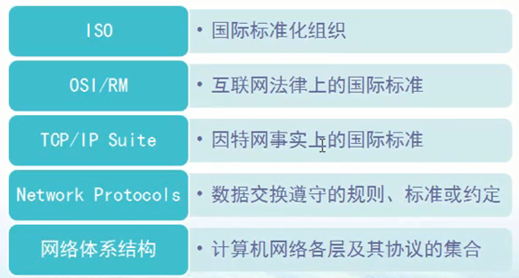
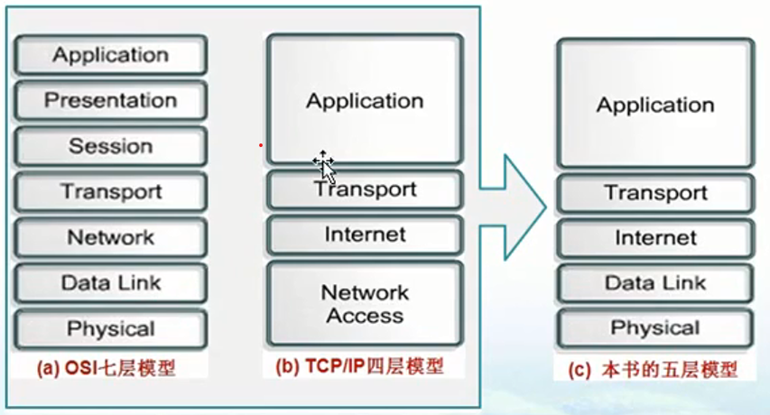
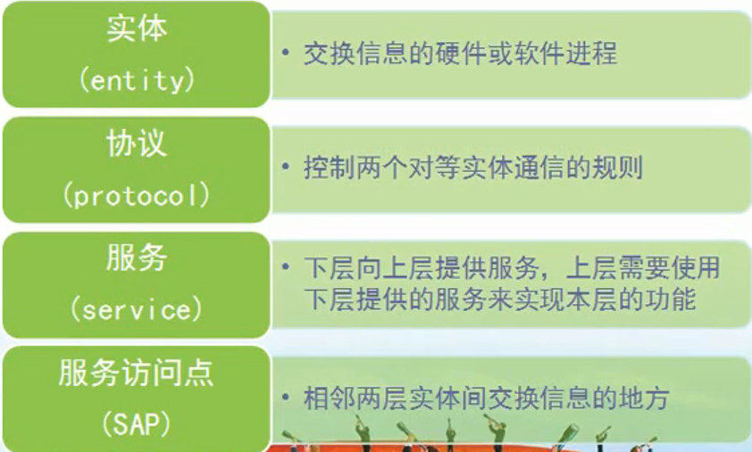
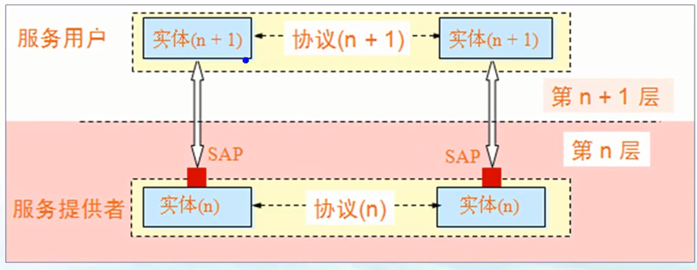

# 计算机网络的体系结构
## 几个基本概念

* iso 
    * 国际标准化组织
* OSI/RM
    * 互联网法律上的国际标准
* TCP/IP Suite
    * 因特网事实上的国际标准
* Network Protocols
    * 数据交换遵守的规则、标准或约定
* 网络体系结构
    * 计算机网络各层及其协议的集合

## 分层的好处
* 有利于标准化
* 分层之后，某一层的变化不会影响其他层

## OSI 参考模型
* 应用层 
    * 能够产生网络流量能够和用于交互的应用程序。
* 表示层
    * 数据传输是否要加密，压缩，开发人员要考虑的问题
* 会话层
    * 服务和客服端建立的会话，可以查木马 netstat -nb
    * 木马和病毒的区别
        * 木马盗取信息，远程控制
        * 病毒，破坏性
* 传输层
    * 可靠传输(建立会话)，不可靠传输，流量控制
    * IP地址编制，选择最佳路径
* 数据链路层
    * 数据如何封装
    * 添加物理层地址 MAC
* 物理层
    * 电压、接口标准

## 案例
* 在应用层不要包含网络层的信息，连接的是计算机名，名称解析成新的ip地址就好了

## TCP/ip协议层

## 开放系统信息交换设计的几个概念

* 实体
    * 交换信息的硬件或软件进程
* 协议
    * 控制两个对等实体通信的规则
* 服务
    * 下层向上层提供服务，上层需要使用下层提供的服务来实现本层的功能
* 服务访问点
    * 相邻两层实体间交换信息的地方
    * 实例
        

