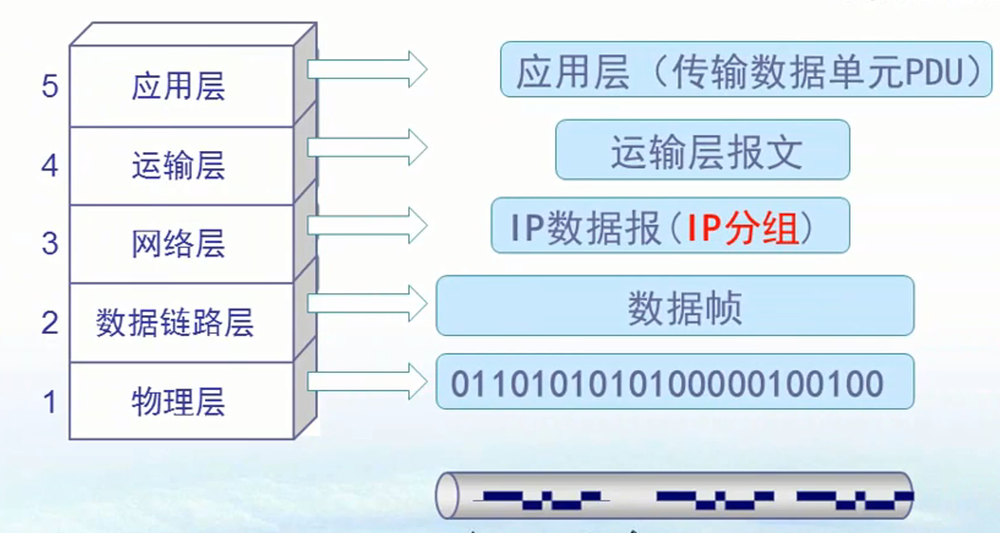
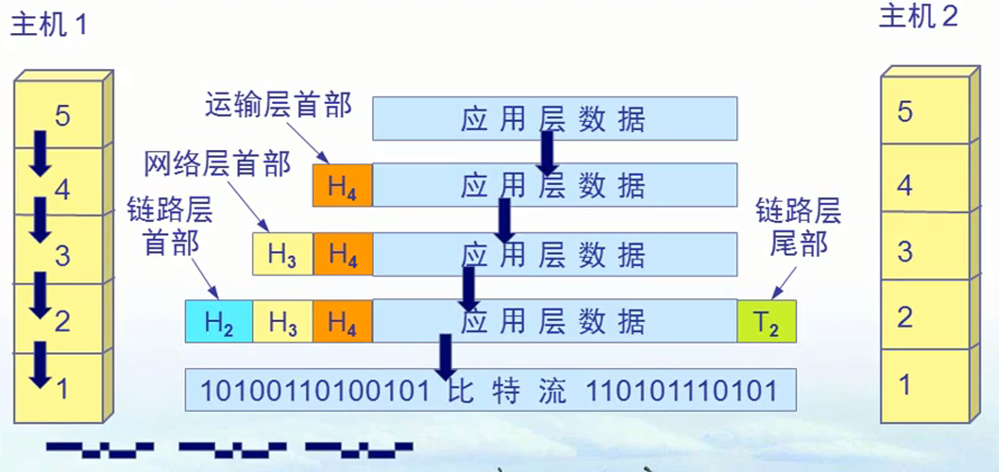
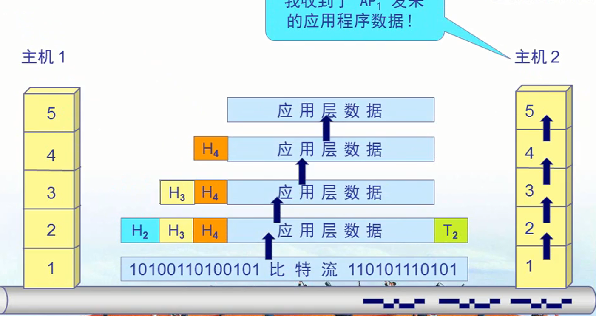

## 各层对应的数据单元

* 应用层
    * 传输数据单元PDU(一个电影，问价)
* 运输层
    * 运输层报文
    * 在传输之前将数据分成段，编上号，加上协议标识，这个叫做段
*网络层
    * ip数据包(ip分组)
    * 段加上ip地址，叫做数据包
* 数据链路层
    * 数据帧
    * ip数据包加上Mac地址，叫做数据帧
* 物理层
    * 二进制比特流
    * 二进制比特
## 数据发送接收过程

## 客服进程和服务器进程使用TCP/ip协议进行通信
* 数据从客户机由应用上层，一只向下传输，通过物理层到对方机器，对方由物理层向上传输，到应用层解析

## 联系
* 查看会话
* 查看建立会话的程序
* ping 地址 查看往返时间
* 查看计算机的网络连接状态